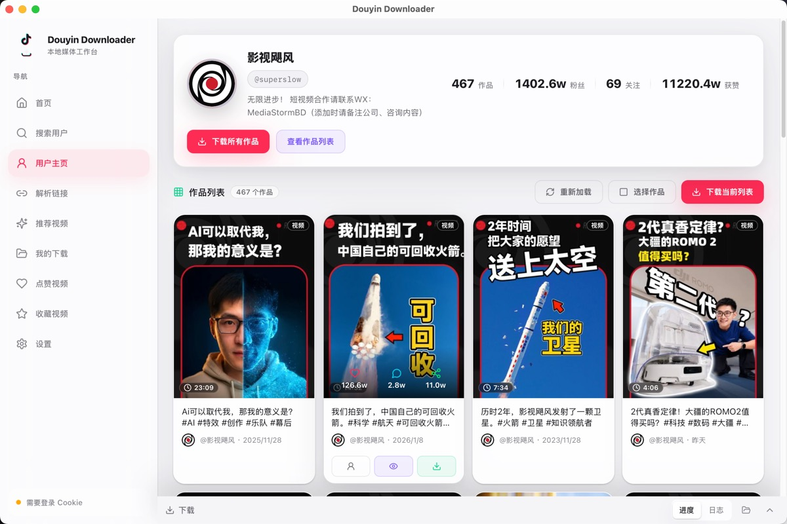

<div align="center">


# 💎 Douyin Downloader

### 跨平台桌面抖音下载终端（Rust / Tauri 2.0 重构版）

[](https://www.rust-lang.org/)
[](https://tauri.app/)
[]()
[](LICENSE)

[立即下载](#下载安装) • [界面预览](#界面预览) • [功能特性](#-功能特性与技术亮点) • [快速开始](#快速开始)

---

> **🌟 如果觉得本项目对您有帮助，请右上角点个 Star 支持作者持续维护！**

</div>

---

## ⚡ 功能特性与技术亮点

* 🚀 **极速去重**：搭载单次磁盘扫描与内存交集去重算法，查重速度由分钟级**暴降至毫秒级**，完全零二次物理磁盘 I/O 开销。
* 📡 **防重绘事件节流**：对批量跳过的进度推送实施高频节流保护，避免前端重绘风暴，海量下载绝不卡死。
* 🎨 **双模自适应桥接**：自适应无缝切换 Tauri 原生 IPC 与标准 HTTP Fetch 接口，降低多版本维护成本。
* 🔒 **本地播放与安全代理**：内置 Byte-Range 本地媒体播放代理，支持视频/图集/Live Photo 的流畅 Seek 拖动播放。

---

## 🌟 功能矩阵

<div align="center">

| 🏷️ 模块领域 | 🛠️ 核心功能 | 🎯 工业级技术指标 |
| :--- | :--- | :--- |
| **智能检索** | 用户页与主页分立，支持分页、输入补全、清除检索历史。 | 上下文环境全局保留，平滑切换 |
| **单条解析** | 解析页提供历史记录补全，支持键盘上下选择及单条下载。 | 支持多媒体、Live Photo 与图集自动解析 |
| **批量下载** | 获取作者全部作品、点赞、收藏，多线程并发调度下载。 | 并发度、存放路径、文件命名规则动态可调 |
| **沉浸播放** | 推荐 Feed 流去重加载，支持滚轮沉浸切换、作者页一键跳转。 | 弱网智能重试提示，拒绝黑屏卡死 |
| **本地管理** | 支持“文件模式/作品模式”双向切换，全量搜索及物理定位。 | 支持在应用内直连本地安全播放代理预览 |
| **登录态保障** | 内置安全的 Chromium/Webkit 登录窗口，动态补全 Cookie。 | 本地解密读取，隐私全在本地 |

</div>

---

---

## 界面预览

### 首页 / 主界面

进入搜索用户、解析链接、推荐视频、收藏视频和本地下载管理入口。

<p align="center">
  <a href="docs/home.jpg">
    
  </a>
</p>

### 搜索用户

支持历史记录、分页、输入补全、清除记录，并可一键跳转用户主页。

<p align="center">
  <a href="docs/get_user.jpg">
    
  </a>
</p>

### 用户详情与批量下载

查看用户资料、作品列表，并执行批量下载或单个作品下载。从搜索、播放器作者名或其他入口进入时都会打开统一的用户主页。

<p align="center">
  <a href="docs/user_detail.jpg">
    
  </a>
</p>

### 推荐视频流

支持推荐视频的沉浸式刷视频流与一键下载，实现去重加载。

<p align="center">
  <a href="docs/recommend.jpg">
    
  </a>
</p>

### 沉浸式播放器

推荐视频、作品详情和本地下载内容使用沉浸式预览。播放器支持滚轮切换上下视频、点击作者进入主页，弱网场景会显示更明确的加载、重试 and 错误提示。

<p align="center">
  <a href="docs/playvideo.jpg">
    
  </a>
</p>

---

## 快速开始

### 下载安装

从 [Releases](https://github.com/anYuJia/douyin-downloader-rust/releases/latest) 下载对应平台的安装包：

| 平台 | 推荐文件 | 说明 |
|:---|:---|:---|
| Windows | `Douyin.Downloader_*_x64-setup.exe` | 常规安装版，适合长期使用 |
| Windows | `Douyin-Downloader_*_x64_portable.exe` | 便携版，不需要安装 |
| macOS Apple Silicon | `Douyin.Downloader_*_aarch64.dmg` / `*_macos-arm64_portable.zip` | M1/M2/M3/M4 等芯片 |
| macOS Intel | `Douyin.Downloader_*_x64.dmg` / `*_macos-x64_portable.zip` | Intel 芯片 |
| Linux Debian/Ubuntu | `Douyin.Downloader_*_amd64.deb` | 适合 Debian、Ubuntu、Linux Mint 等 |
| Linux Fedora/openSUSE/RHEL | `Douyin.Downloader-*-1.x86_64.rpm` | 适合 RPM 系发行版 |
| Linux 通用 | `Douyin.Downloader_*_amd64.AppImage` | 免安装便携运行 |

`.sig`、`latest.json`、`windows.json`、`darwin.json`、`linux.json` 主要用于自动更新和签名校验，普通安装通常不需要手动下载。

### 首次使用

1. 打开应用后，先在设置中完成 Cookie / 登录配置
2. 使用搜索用户、解析链接、推荐视频、收藏视频或点赞列表获取内容
3. 选择单个作品下载，或进入用户/收藏/点赞列表执行批量下载
4. 在底部下载面板查看实时进度，在“我的下载”中以文件模式或作品模式管理本地文件

> **macOS 用户**
>
> 首次运行若提示“无法验证开发者”，可执行：
>
> ```bash
> sudo xattr -rd com.apple.quarantine /Applications/Douyin\ Downloader.app
> ```

---

## Cookie、数据与隐私

- Cookie 仅用于本地请求抖音相关接口，不会上传到本项目的服务器
- 下载历史、应用配置和缓存数据保存在本机应用数据目录
- 下载文件默认保存在设置中配置的下载目录
- 推荐视频、收藏视频、点赞列表和部分批量下载能力依赖有效登录态
- 如果接口突然失效，优先检查 Cookie 是否过期、账号是否需要重新验证、网络是否可访问相关域名

---

## 包管理器分发

项目已准备 Homebrew Cask、Scoop 和 winget 的分发模板，见 [packaging/package-managers](packaging/package-managers)。

当前这些模板用于维护和提交包管理器清单。正式进入对应包管理器仓库后，将可以通过命令行安装和更新。

---

## 从源码构建

### 环境要求

- Rust 1.77.2+
- Node.js 18+（可选，用于前端静态检查和分发脚本）
- 系统依赖见 [Tauri 官方文档](https://tauri.app/start/prerequisites/)

### 开发模式运行

```bash
git clone https://github.com/anYuJia/douyin-downloader-rust.git
cd douyin-downloader-rust

cd src-tauri
cargo tauri dev
```

### 构建发布版

```bash
cd src-tauri
cargo tauri build
```

### 本地检查

```bash
cd src-tauri
cargo fmt --check
cargo test
cargo clippy --all-targets --all-features -- -D warnings
```

前端构建检查：

```bash
cd frontend
npm run build
```

---

## CLI 工具 `douyin-dl`

除了桌面应用，项目也提供了一个独立的命令行工具，适合脚本调用、自动化处理和服务器环境。

### 功能

| 命令 | 说明 |
|:---|:---|
| `douyin-dl parse <URL>` | 解析抖音链接，输出视频元信息（JSON / 可读文本） |
| `douyin-dl download <URL>` | 下载单个视频，实时显示进度 |
| `douyin-dl config show` | 查看当前配置 |
| `douyin-dl config set <key> <value>` | 修改配置（Cookie、下载目录等） |
| `douyin-dl search <keyword>` | 搜索抖音用户 |
| `douyin-dl user <sec_uid>` | 查看用户详情与近期作品 |
| `douyin-dl feed` | 获取推荐视频流 |

### 有 Rust 环境：从源码构建

```bash
cd src-tauri
cargo build --release --bin douyin-dl
```

产物在 `src-tauri/target/release/douyin-dl`，可直接运行或放入 PATH：

```bash
ln -sf "$(pwd)/src-tauri/target/release/douyin-dl" /usr/local/bin/douyin-dl
```

### 没有 Rust 环境：下载预编译二进制

从 [Releases](https://github.com/anYuJia/douyin-downloader-rust/releases) 页面下载对应平台的 `douyin-dl` 二进制（macOS / Linux / Windows），解压后即可使用。

### 首次配置

CLI 与桌面应用共享同一份配置文件（`~/.config/douyin-downloader/config.json`）：

```bash
# 设置 Cookie（从浏览器开发者工具复制）
douyin-dl config set cookie "your-cookie-string"

# 设置下载目录
douyin-dl config set download_path "/home/user/Videos/Douyin"

# 查看当前配置
douyin-dl config show
```

### 使用示例

```bash
# 解析视频链接，获取基本信息
douyin-dl parse "https://www.douyin.com/video/7341234567890123456"
douyin-dl parse --format plain "https://v.douyin.com/xxxxx/"

# 下载视频
douyin-dl download "https://www.douyin.com/video/7341234567890123456"
douyin-dl download -o ~/MyVideos "https://v.douyin.com/xxxxx/"

# 搜索用户
douyin-dl search "某个昵称"

# 查看用户作品
douyin-dl user "<sec_uid>" --limit 10

# 管道输出（适合脚本）
douyin-dl parse "..." | jq .aweme_id
douyin-dl feed --count 5 | jq '.videos[] | {id: .aweme_id, desc: .desc}'
```

### Claude Code Skill

项目附带了 Claude Code Skill（`skill/douyin-downloader/`），可在 Claude Code 中直接通过自然语言调用 CLI。

---

## 技术栈

- **桌面框架**：Tauri 2
- **后端**：Rust、Tokio、Reqwest、Axum
- **前端**：React 19、Vite、TypeScript、Tailwind CSS
- **更新机制**：Tauri updater + GitHub Release metadata
- **分发产物**：Windows NSIS / portable exe、macOS dmg / app zip、Linux deb / rpm / AppImage

---

## 常见问题

### 为什么有些功能需要登录？

推荐视频、收藏视频、点赞列表、部分批量下载能力依赖有效 Cookie / 登录态。未登录时，接口可能拒绝访问或返回不完整数据。

### 可以只下载单个视频吗？

可以。除了批量下载，也支持通过粘贴链接解析后进行单个下载。

### 下载文件保存到哪里？

下载目录可以在设置中修改。历史记录和“我的下载”页面支持文件模式/作品模式、全量搜索、直接播放、定位文件夹和删除本地文件。

### 推荐视频接口为什么有时不稳定？

推荐流、详情、点赞等接口都可能受到平台风控、Cookie 状态和网络环境影响。这类现象属于预期范围。

### 播放器提示加载失败怎么办？

先确认网络连接是否稳定，再点击播放器中的“重试”。如果仍失败，通常是播放地址过期、Cookie 失效、平台拒绝或本地媒体代理暂时无法取得资源。可以刷新详情、重新登录，或稍后再试。

### 自动更新失败怎么办？

自动更新依赖 GitHub Release。若当前网络无法访问 GitHub，可手动打开 Releases 页面下载对应平台的新版本安装包。

### 为什么头像或封面偶尔显示默认图？

头像、封面由平台接口返回。接口未返回、图片过期或网络异常时，应用会显示默认占位图，不影响下载功能。

---

## 已知限制

- 对登录态和 Cookie 有依赖
- 接口可能随抖音策略变化而失效或返回结构变化
- 某些平台首次运行需要额外系统权限或安全确认
- 当前仍以桌面端本地使用为主，不是云服务方案
- 移动端暂未产品化；如果后续尝试，会优先验证 Android WebView 登录和 Cookie 获取方案

---

## 贡献与反馈

- 发现问题：欢迎提交 [Issue](https://github.com/anYuJia/douyin-downloader-rust/issues)
- 想改进功能：欢迎发起 Pull Request
- 发布与包管理器分发相关脚本见 [scripts](scripts) 和 [packaging/package-managers](packaging/package-managers)

---

## 相关项目

- [DY_video_downloader](https://github.com/anYuJia/DY_video_downloader) - Python 原版

---

## License

本项目基于 [MIT License](LICENSE) 开源。

---

## 免责声明

本工具仅供个人学习研究使用，请勿用于商业用途或大规模爬取。因滥用导致的后果，项目贡献者不承担责任。

---

## Star History

<a href="https://star-history.com/#anYuJia/douyin-downloader-rust&Date">
  
</a>

<p align="center">
  <a href="https://star-history.com/#anYuJia/douyin-downloader-rust&Date">https://star-history.com/#anYuJia/douyin-downloader-rust&Date</a>
</p>

---

<p align="center">觉得有用？给个 Star 支持一下</p>
